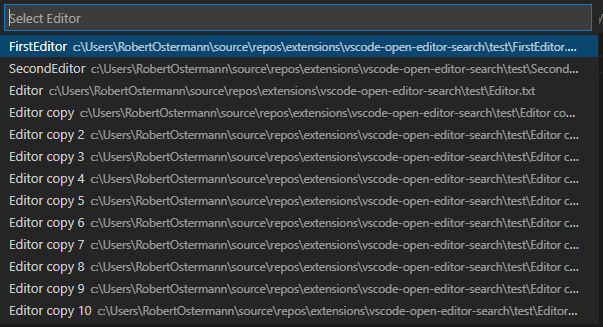

# open-editor-search

## Features

Search through open editors with an input search bar.

## Extension Settings

| Name                             | Description                                                                       | Default |
| -------------------------------- | --------------------------------------------------------------------------------- | ------- |
| `open-editor-search.fuzzySearch` | Should the quick pick search use fuzzy search instead of VSCode's default search. | `true`  |

## Known Issues

This extension currently cycles through each editor to determine the open editors.  
VSCode does not currently provide an API to determine which editors are open.
